

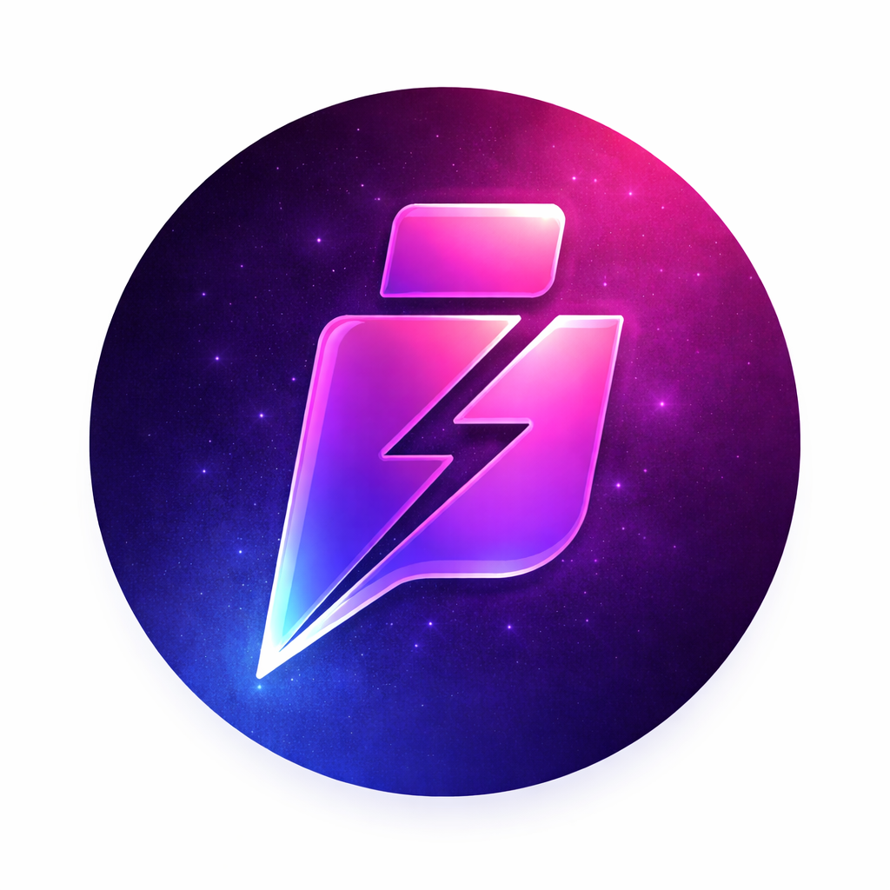

# Inkavi

### *Votre bibliothèque Kavita, toujours avec vous*

**Application mobile iOS/Android native pour accéder à votre serveur Kavita auto-hébergé**

[Kavita](https://www.kavitareader.com/) • [Documentation](https://wiki.kavitareader.com/)

---

## 🌟 Présentation

**Inkavi** transforme votre expérience de lecture en vous donnant un accès mobile complet à votre serveur [Kavita](https://www.kavitareader.com/). Profitez de vos mangas, comics, BD et livres préférés directement depuis votre smartphone ou tablette, avec une interface élégante et performante conçue spécialement pour la lecture mobile.

### ✨ Pourquoi Inkavi ?

- 🎯 **Interface native** - Application 100% native pour iOS et Android, optimisée pour les performances
- 🔄 **Synchronisation totale** - Progression de lecture synchronisée sur tous vos appareils
- 📱 **Expérience mobile fluide** - Conçue spécifiquement pour le tactile et la lecture nomade
- 🎨 **Design moderne** - Interface épurée et intuitive avec support du mode sombre
- 🔒 **Sécurité renforcée** - Protection par code PIN et authentification sécurisée
- ⚡ **Performances optimales** - Préchargement intelligent et cache pour une lecture fluide

---

## 🔧 Configuration & Connexion

**Inkavi** se connecte à votre serveur Kavita auto-hébergé. Voici comment le configurer :

### Prérequis
- Un serveur **Kavita** installé et accessible (version 0.7+)
- Une **clé API** générée depuis votre interface Kavita

### Obtenir votre clé API Kavita

1. Connectez-vous à votre serveur Kavita (navigateur web)
2. Allez dans **Paramètres** → **Compte** → **Clé d'authentification / OPDS**
3. Cliquez sur **Generate API Key** (ou utilisez une clé existante)
4. **Copiez la clé** (format : `adc40f62-656f-4000-b108-bce4e1d9aa93`)

### Configuration dans Inkavi

Au premier lancement de l'application :

1. **URL du serveur** : Entrez l'URL complète de votre serveur Kavita
   - Exemple : `https://kavita.votredomaine.com` ou `http://192.168.1.10:5000`
   - ⚠️ **Important** : L'URL doit être accessible depuis votre appareil mobile

2. **Clé API** : Collez la clé API générée précédemment
   - Format : `xxxxxxxx-xxxx-xxxx-xxxx-xxxxxxxxxxxx`

3. **Tester la connexion** : L'application vérifie automatiquement la connexion

4. **Connexion au compte** : 
   - Entrez vos identifiants Kavita (nom d'utilisateur + mot de passe)
   - L'application récupère un **JWT token** pour sécuriser les échanges

### Fonctionnement de l'authentification

**Inkavi** utilise un système d'authentification en deux étapes :

1. **API Key** : Authentifie l'application auprès du serveur Kavita
2. **JWT Token** : Authentifie l'utilisateur et sécurise chaque requête API
   - Token stocké de manière sécurisée (Keychain iOS / Keystore Android)
   - Renouvelé automatiquement à chaque connexion
   - Expire après 10 jours d'inactivité

### Sécurité

- 🔒 **Connexion chiffrée** : Utilisez HTTPS pour sécuriser vos échanges
- 🔑 **Stockage sécurisé** : Les identifiants sont protégés par le système
- 🔐 **Code PIN** : Protection optionnelle de l'accès à l'application
- 🚫 **Pas de tracking** : Aucune donnée n'est envoyée à des tiers

---

## 🚀 Fonctionnalités principales

### 📖 Lecteur avancé
- **Modes de lecture multiples** : Gauche à droite (manga occidental), Droite à gauche (manga japonais), Défilement vertical
- **Zoom et navigation tactile** : Contrôle intuitif avec gestes multi-touch
- **Filtres visuels** : Modes Sépia et Nuit pour un confort de lecture optimal
- **Contrôle de luminosité** : Ajustez directement depuis le lecteur
- **Mode immersif** : Lecture plein écran sans distractions

### 📚 Gestion de bibliothèque
- **Navigation intuitive** : Accédez rapidement à vos séries, collections et bibliothèques
- **Recherche puissante** : Trouvez instantanément vos contenus favoris
- **Filtres et tri** : Organisez votre bibliothèque selon vos préférences
- **Favoris et listes** : Marquez vos séries préférées et créez des listes de lecture
- **Progression visuelle** : Voyez instantanément votre avancement dans chaque série

### 🔄 Synchronisation multi-appareils
- **Progression temps réel** : Reprenez votre lecture exactement où vous l'avez laissée
- **Sync cloud** : Sauvegarde automatique de votre progression
- **Backup automatique** : Vos données sont protégées

### 📊 Statistiques de lecture
- **Temps de lecture** : Suivez vos sessions et habitudes de lecture
- **Pages lues** : Visualisez votre progression
- **Séries favorites** : Découvrez vos statistiques personnelles
- **Streaks de lecture** : Maintenez votre rythme de lecture quotidien

### 🌍 Internationalisation
- **Multi-langues** : Interface en français et anglais
- **Adaptation culturelle** : Gestion native des formats de lecture (manga, BD, comics)

### 🔐 Sécurité & Confidentialité
- **Code PIN** : Protégez l'accès à votre application
- **Authentification sécurisée** : Connexion chiffrée à votre serveur Kavita
- **Stockage local sécurisé** : Vos identifiants protégés par le keychain du système
- **Pas de tracking** : Respect total de votre vie privée

---

## 🛠️ Technologies

**Framework & Langage**
- Flutter 3.11+ (UI cross-platform)
- Dart (Langage)
- Développé avec [Qoder](https://qoder.dev) (IDE agentique Flutter)

**Architecture & State Management**
- Architecture MVVM (Model-View-ViewModel)
- Riverpod (State management réactif)
- Provider pattern

**Backend & API**
- API REST Kavita
- Dio (Client HTTP)
- JWT Authentication

**Stockage & Cache**
- Shared Preferences (Préférences utilisateur)
- Flutter Secure Storage (Données sensibles)
- Cache Manager (Images et contenus)

**Features**
- Cached Network Image (Optimisation images)
- Photo View (Zoom et navigation)
- Local Auth (Biométrie et PIN)

---

## 📸 Screenshots

### Configuration & Navigation

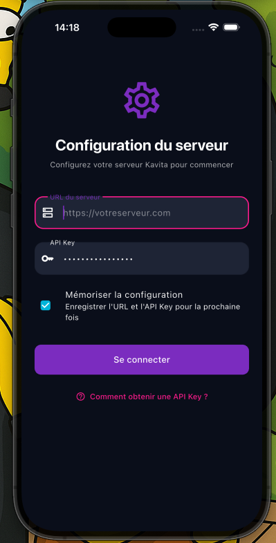

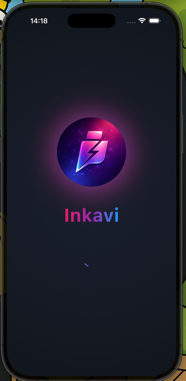

*Configuration serveur • Connexion • Accueil*

---

### Bibliothèque & Collections

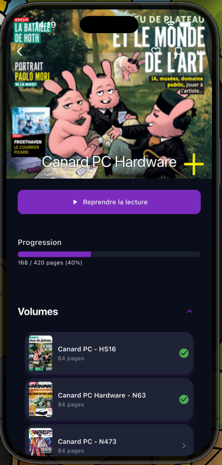
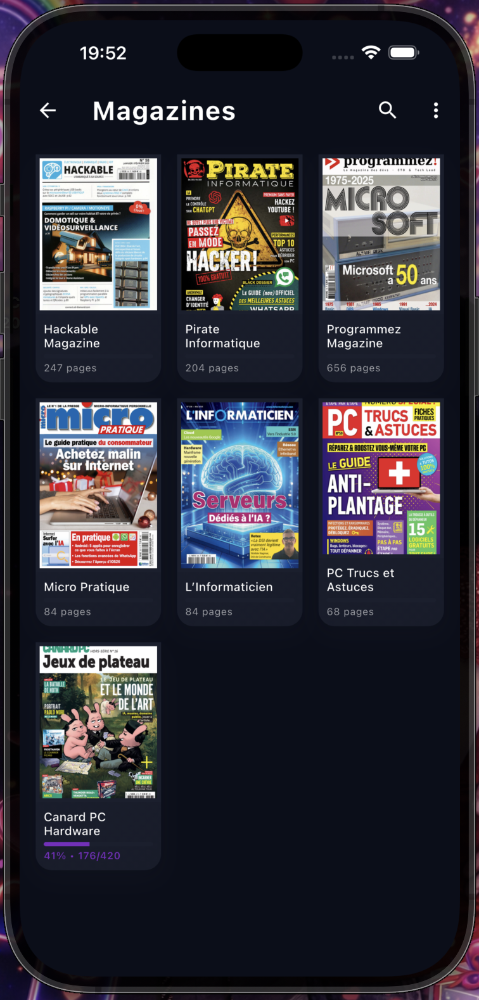
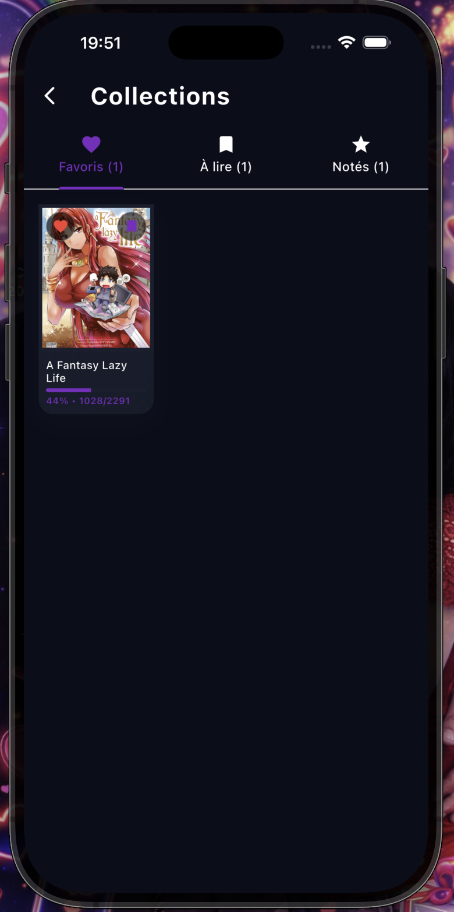

*Bibliothèque principale • Détails • Collections*

---

### Lecteur & Volumes

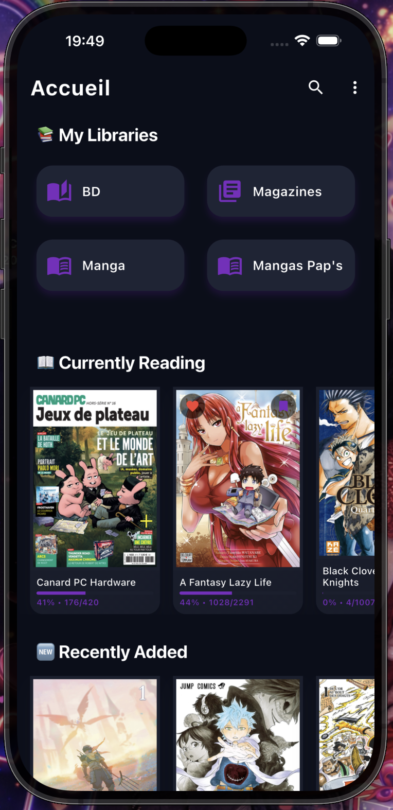
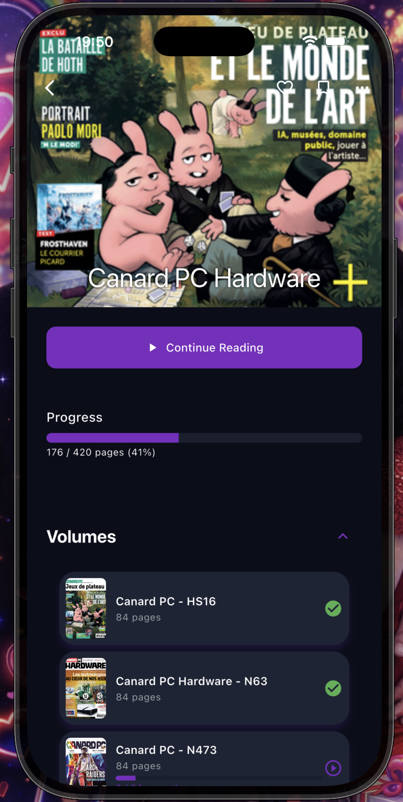
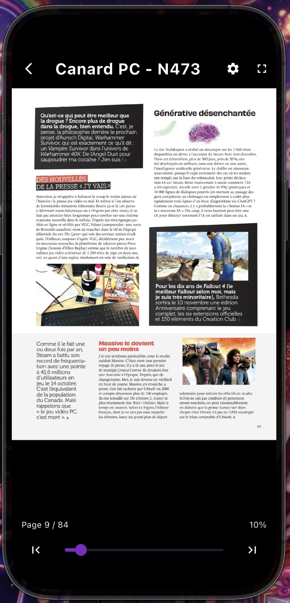

*Page série • Liste volumes • Lecteur*

---

### Options & Paramètres

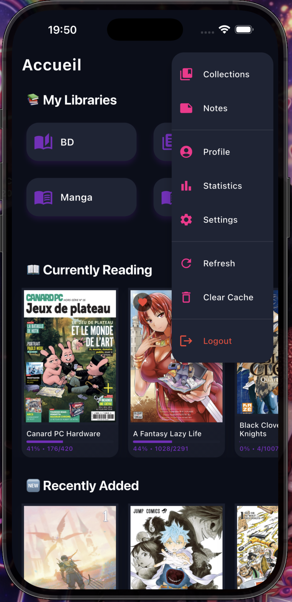
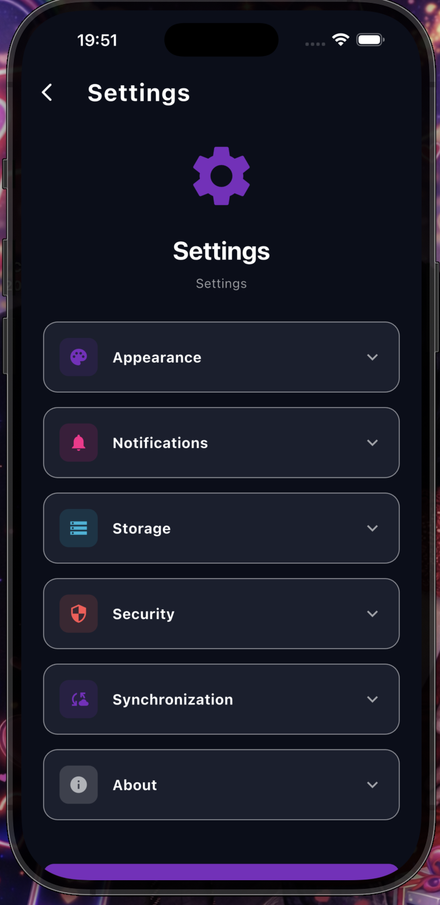

*Options de lecture • Configuration • Paramètres*

---

### Statistiques & Notes

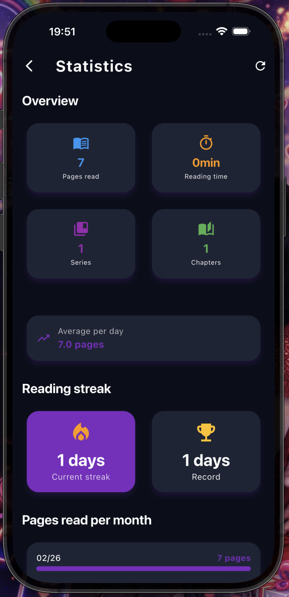
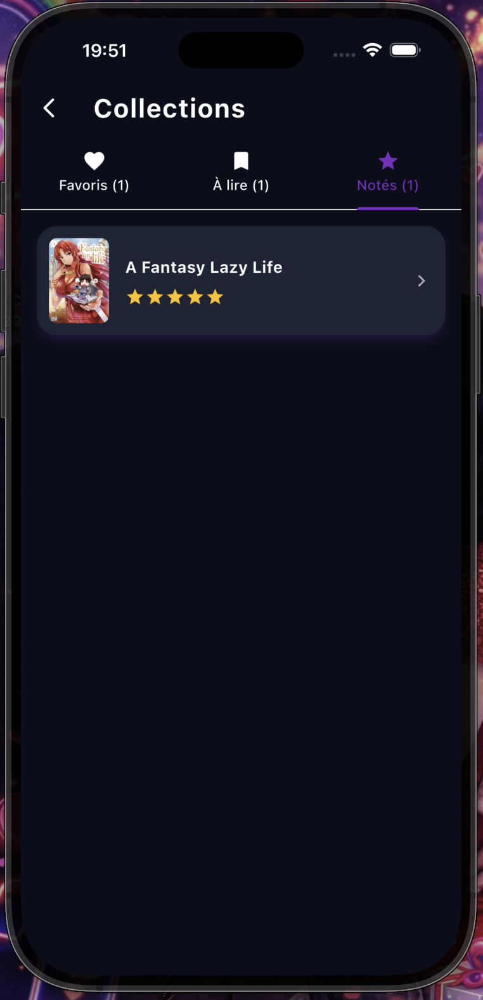

*Statistiques de lecture • Système de notes*

---

## 🔗 Liens utiles

- 🌐 [Site officiel Kavita](https://www.kavitareader.com/)
- 📖 [Documentation Kavita](https://wiki.kavitareader.com/)
- 💬 [Discord Kavita](https://discord.gg/kavita)
- 🐛 [GitHub Kavita](https://github.com/Kareadita/Kavita)

---

## ⚖️ Licence & Code Source

Ce projet est **personnel et privé**. Le code source n'est pas distribué publiquement.

**Inkavi** est un client non-officiel pour [Kavita](https://www.kavitareader.com/), développé de manière indépendante.

---

**Fait avec ❤️ pour les amateurs de lecture numérique**

*Inkavi n'est pas affilié à Kavita. Kavita est une marque déposée de ses propriétaires respectifs.*

